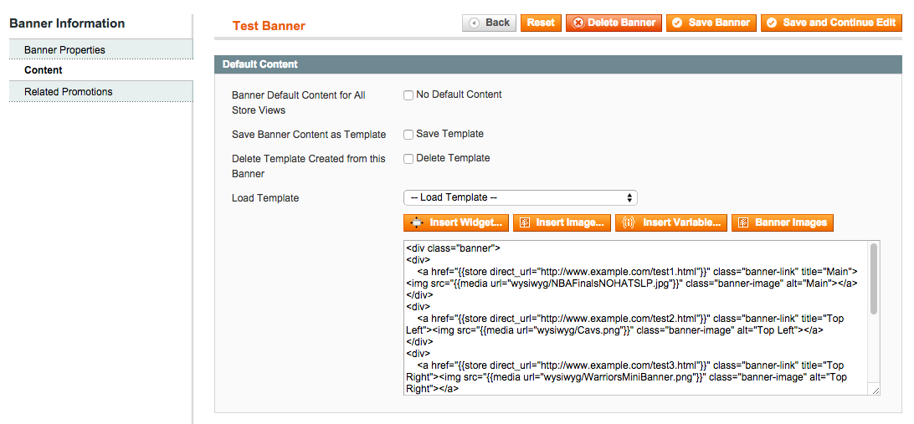
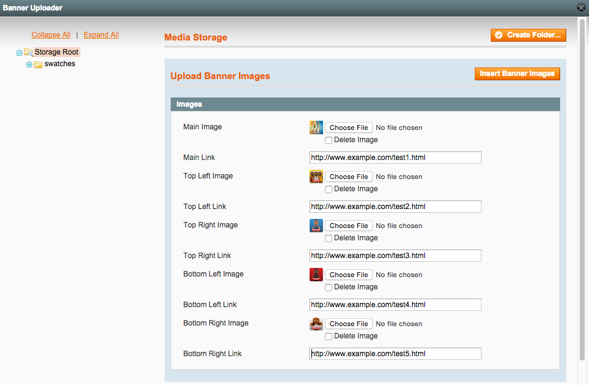

Banner Uploader
==================
Allows client admin to set Enterprise banner images and links without having to touch HTML.

Description
-----------
Clients often have difficulty creating and editing Magento Enterprise Edition banners. 
The problem is that the banner HTML is difficult to edit. This extension loads all the
banner images and link into a popup that the admin can edit. Also has the ability to
save templates of banner content.

How to use
----------

Upload the extension files to your server. In the admin, under CMS -> Banners,
open up a banner. Note the HTML content that you don't want the client to edit:

Each link should have a banner-link class and each image a banner-image class. Click 
on the Banner Images button on top of the banner content:

You can also save banner content as templates to be used by other templates.